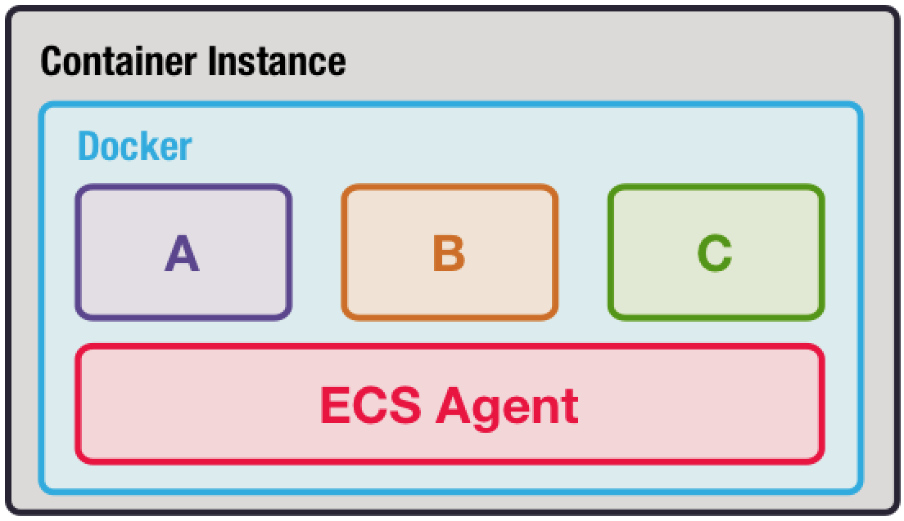
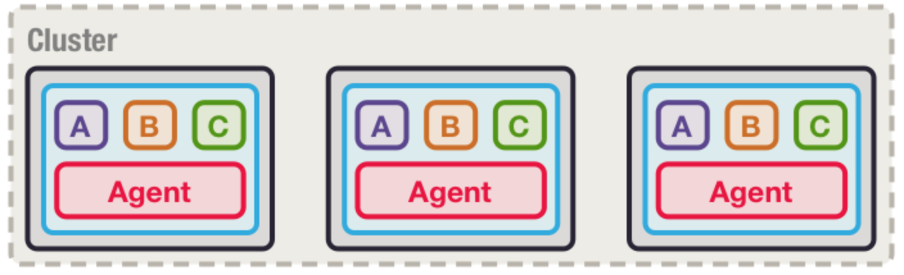
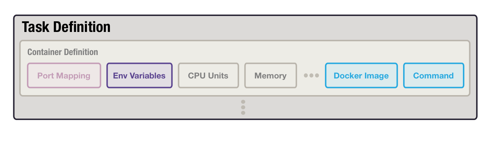

# Deploying Clustered Akka applications on Amazon ECS

At LoyaltyOne, we recently started to containerize our services and deploy them to Amazon ECS; a platform for running Docker containers. 

Our team maintains a service powered by a multi-node Akka cluster. Akka cluster enables us to build distributed, fault-tolerant services which can span multiple machines. Given our recent move to Docker, the team wanted to deploy our clustered service using the same platform we use for all services: Amazon ECS. In this post we will cover the basics of Amazon ECS along with a strategy for deploying clustered Akka applications on it.

Before we dive into the specifics of Clustered Akka service deployments, lets go through some Amazon ECS basics:

## Amazon Elastic Container Service Detour

Amazon ECS is a Docker container orchestration service which makes it easy to run containers on a cluster of EC2 instances. Think of this cluster of EC2 instances as a pool of resources such as CPU and memory, where you run your containers without worrying about which underlying EC2 instance they run on. This concept is not new, there are other platforms such as Kubernetes and Docker Swarm which offer similar features. One of the reasons we selected ECS is because it is a service managed by Amazon rather than us. This means that our team can focus on deployment to the platform rather than maintenance of the platform.

Lets get some basic concepts out of the way:

### Container Instances

 A **container instance** is an EC2 instance which has docker installed and is running an ECS Agent. Among other duties, this agent has two main missions, it reports system information back to ECS and runs the containers ECS tells it to. 



*In the diagram above, A, B, and C would be docker containers launched by the agent.*

### ECS Cluster

Container instances group together to form an **ECS Cluster**




What we have so far is an ECS Cluster, but how do we tell ECS to run our dockerized services?

### Task Definition

A task definition is like a recipe describing how to run your containers. It has information such as the ports to expose on the container, the memory and CPU to allocate as well as the Docker image from which to launch the container. A **task** is an instantiation of a task definition, it represents your running containers.

*A Task Definition is essentially a way to specify parameters to supply to the docker run command*


Although a **Task Definition **describes how to run containers, we usually need some more functionality when running long lived services. For example, what happens if our container dies? How many instances of our containers should ECS run? How can we load balance traffic to multiple instances of our containers? 

### Service

A **Service** in ECS allows you to run and maintain a desired number of tasks. It ensures that if your tasks die, they are restarted. It also allows you to register your containers with a load balancer. 

So how do all of these components fit together to deploy our dockerized services? Simple, we issue a request to Amazon ECS and tell it to create a service to deploy. It will handle the creation of tasks from the specified Task Definition and run them on the pool of resources that is the ECS cluster.

### ECS Recap

At its essence, ECS is a task scheduler where the tasks it creates map to running docker containers. It determines based on available resources, where to run your containers in an ECS Cluster. We will utilize this platform to run tasks representing nodes in our clustered Akka application. 


## Clustered Akka Application Deployment

For our typical *stateless* services, switching to docker was relatively straightforward. The instances of these services do not need to know about each other, they simply accept requests behind a load balancer. The deployment of a clustered Akka application however, requires every instance (node in akka) to know about all other running instances in order to form a cluster.

Before we dive into the deployments lets cover some basics of cluster formation in Akka:

### Cluster Formation Primer

In order to form a cluster every node needs be configured with the address of at least one existing node in the cluster, a list of initial contact points into the cluster. Any node which serves as an initial contact point for other nodes to join the cluster is known as a **seed node**.  Other than being designated as initial contact points, seed nodes function exactly the same as other nodes in the cluster. 

When a node launches, it reaches out to all nodes in its configured **seed list**, sending a cluster join request to the first seed that responds. The node which receives the join request tells other nodes about the request via a **gossip** protocol. Once every node in the cluster sees the join request from the new node, it becomes a member in the cluster. 

```sequence
title: Node A Joins Akka Cluster
participant Node A
participant Seed 1
participant Seed 2
Node A->Seed 1: Hello, anyone home?
Node A->Seed 2: Hello, anyone home?
note right of Seed 2: Seed 2 is first to respond
Seed 2-->Node A: Hi, Node A
Node A->Seed 2: I'm joining!
Seed 1-->Node A: ... Hi Node A
note right of Node A: Node A ignores it
note right of Seed 2: Tells everyone about Node A
Seed 2->Seed 1: FYI, Node A is joining
Seed 1-->Seed 2: Cool story bro!
Seed 2-->Node A: You're in, homie!
note right of Seed 2: Node A is now a member

```

*A simplified example of a node joining a cluster with two nodes. Some details are omitted for simplicity*

But how can a node join a cluster if it is the first node to join? Isn’t this a classic chicken and egg problem? As it turns out, the first seed node in the **seed list** of *all* nodes will send a join request to itself when it launches, becoming the first member of the cluster. It is thus important that all **seed lists **have the same first node.

### The Challenge

Now that we have an understanding of cluster formation we can discuss some of the challenges present when deploying to ECS:

- All nodes must run inside Docker containers 
- All nodes receive cluster level communication via their **remoting port**, hence they must be addressable on this port from other container instances in the ECS cluster
- One or more seed nodes must be configured to bootstrap the cluster

We will discuss strategies to overcome these challenges under the constraints of ECS

### Prerequisites

- JDK8+
- Docker
- SBT
- An existing ECS Cluster
- Access to an AWS Account
- Working knowledge of Docker

### Overview

Our first step towards deployment will be to package our clustered application as a docker container and publish it to a Docker registry. We will use SBT to accomplish these steps.

Once our artifact is published we will tackle the problem of making nodes addressable across container instances. We will then run our nodes by creating a Task Definition and ECS Service.

In order to manage the seed list of every node we will utilize an Akka library called ConstructR which uses Apache Zookeeper to store a centralized seed list.

We have created a sample clustered application which addresses the steps and challenges above. The sample application can be found on Github at [Theatre Booking Application](https://github.com/LoyaltyOne/theatre-booking-akka-example)

#### Dockerizing Applications with SBT Native Packager

Using the SBT Native Packager plugin it is trivial to package your applications as Docker containers. We can utilize any docker base image that has JRE 8 and bash installed.

Enable sbt native packager plugin to dockerize the application by adding the following to `project/plugins.sbt`:

```scala
addSbtPlugin("com.typesafe.sbt"  % "sbt-native-packager" % "1.2.2")
```

Next, in our `build.sbt`, we will enable the plugin on our single module SBT project:

```scala
lazy val root = (project in file(".")).enablePlugins(JavaAppPackaging)
```

 We can now specify a Docker registry to which we will publish our image. In our example, we will publish to the LoyaltyOne Docker Hub repository:

```scala
dockerRepository := Some("loyaltyone")
```

We want our image to be published to `loyaltyone/theatre-example` on DockerHub so we need to ensure our project name is `theatre-booking` in `build.sbt`:

```scala
name := "theatre-example"
```

When we publish our image, the build's `version` property will be used to tag our image. We would also like the image to be tagged with the `latest` tag. This tag will always point to the most recent image we publish. To set this behaviour we can set `dockerUpdateLatest`:

```scala
dockerUpdateLatest := true
```

##### Publishing Our Image

Now that we've configured our build, we can publish our image to DockerHub. In order to do so, we first need to authenticate

```bash
$ docker login
```

You will be asked to enter your username and password for DockerHub

Once logged in, we can publish our image by running

```bash
$ sbt docker:publish
```

Our image is now on DockerHub as `loyaltyone/theatre-example:latest`

#### Making Nodes Addressable Across ECS Container Instances

As a default, when Docker containers are launched, they are connected to a virtual bridge device called **docker0**. This bridge has an IP address range from which it assigns an IP to each container connected to it. Inside a container, it's **eth0** interface will be assigned the IP given by the bridge.  

Why is this important? Well, when we run an Akka Cluster node within a Docker container, the default behaviour of the node is to advertise the address of it's binded interface (eth0) to other nodes.  

Lets assume we have two hosts A and B on the same network, with Docker installed:

```bash
Host A: eth0/10.0.1.2, docker0/172.17.0.0/16  
Host B: eth0/10.0.1.3, docker0/172.18.0.0/16
```

For Host A, docker0 will assign IP addresses to containers in the range `172.17.0.0/16`
For Host B, the range will be `172.18.0.0/16`

Lets assume we have two nodes running on the hosts:

```bash
Containers
Node A: eth0/172.17.0.2  Port Bindings: 2552 -> 2552
Node B: eth0/172.18.0.2  Port Bindings: 2552 -> 2552 (Seed)
```

When Node A tries to join Node B to form a cluster, it will try to reach Node B at `172.18.0.2:2552`. For this to work, Host A would need to know how to route packets to `172.18.0.2`; which it doesn't. Unfortunately, ECS does not currently provide a routing mechanism for containers to directly address each other across host machines.

How can we get around this problem? Luckily, Akka provides a way to advertise nodes on an address different than what they bind to. We need nodes to advertise themselves using the port and IP of their *host* rather than their container port and IP.

##### Configuring Akka Remoting

Akka Remoting handles the network level communication for Akka Cluster, so we will configure Akka Remoting. We can achieve the desired behaviour by configuring both a `hostname` and `bind-hostname` along with their port counterparts in `src/main/resources/application.conf`:

```
akka.remote {
    enabled-transports = ["akka.remote.netty.tcp"]
    netty.tcp {
      bind-hostname = 0.0.0.0
      bind-port = 2552

      hostname = ${?HOST_IP} // Advertise using $HOST_IP
      port = ${?HOST_PORT} // Advertise on port $HOST_PORT
    }
}
```

Now all we need to do is get the IP of the host and supply it to the Akka application via the `$HOST_IP`. Because the `HOST_PORT` can be left static for all hosts, we can supply it via the Task Definition environment variable as `"HOST_PORT": 2552`.

##### Getting the Host IP

The host, a container instance, is really just an EC2 instance. To retrieve the IP of an EC2 instance Amazon provides a metadata endpoint which we can query to retrieve the IP.

```
curl http://169.254.169.254/latest/meta-data/local-ipv4
```

The above call would return the private IP of our instance, for Host A this would be `10.0.1.2`

Unfortunately on ECS, the only way to supply the host IP to the container is to hard code it as an environment variable to the container or to mount it into the container as a file. Another option would be to do the metadata query inside the container; this would couple our container heavily to AWS however. This leaves us the option of mounting the host IP as a file. We can do the metadata query, store the IP in a file on the host `/etc/hostip` and mount this file into the container via the ECS Task Definition. 

##### Revisiting Our Example Scenario

Now that we can supply the correct values for  `HOST_IP` and `HOST_PORT`, how would our example node communication play out?

```bash
Host A: eth0/10.0.1.2, docker0/172.17.0.0/16  
Host B: eth0/10.0.1.3, docker0/172.18.0.0/16

Containers
Node A: eth0/172.17.0.2  Port Bindings: 2552 -> 2552
Node B: eth0/172.18.0.2  Port Bindings: 2552 -> 2552 (Seed)
```

Now, when Node A tries to join Node B to form a cluster, it will try to reach Node B at `10.0.1.3:2552`. Host A is now able to send packets to this address since it is in the same network as Host B. On Host B, since we have the Node B container bound to host port 2552, the Docker daemon has set up the necessary routing to direct traffic on this port to our container at `172.18.0.2:2552`. Nodes can now communicate with each other!

So, what have we done so far to achieve node communication?

- Retrieve the IP of the host machine 
- Mount the IP into our containers as a file `/etc/hostip` via the Task Definition
- Fix our `HOST_PORT` to `2552` and bind 2552 from our host to 2552 in our containers
- Configure Akka to advertise on `HOST_IP` and `HOST_PORT` while binding to a local container interface


##### Is this good enough?

This solution works when we want to run a single clustered Akka application on our ECS Cluster, but what happens when we want to run multiple clustered applications on the same cluster?

Since we chose to bind our application to port `2552` on the host, we must choose a different host port to bind to for a second application! In short, to run multiple clustered applications on the same ECS Cluster, we would need to ensure we don't have port conflicts across applications. As you can imagine, keeping track of which port is in use to avoid conflicts would prove to be a maintenance headache!

What if we could let docker choose a random host port to bind to our containers? We know this is possible by binding `0 -> 2552`; docker will choose a random host port for us. However, there is a slight problem. How can our application know about this randomly selected port? After all, we need to supply this randomly selected port via our `HOST_PORT` environment variable. The random port is selected at container launch so there would be no way to pass it into the container during launch or mount it in like we did with `/etc/hostip`

What if, when our containers launch, they could query a local service on the host to figure out their host port bindings and host IP? Such a service would be akin to a mirror for our container, it could see its reflection as seen from the host.

##### Mirror, Mirror, On the Wall, What is My Host Port?

We decided to create such a service; it is called **Docker Mirror**. It is intended to be run as a container on every host in the ECS Cluster, in the same bridge network as all containers. When a container needs to see it's port binding information, it can query Docker Mirror running on it's host machine to easily obtain this information. Instructions for how to run Docker Mirror in your cluster can be found at it's Github [README](https://github.com/LoyaltyOne/docker-mirror). We also have an Amazon CloudFormation template to launch an ECS Cluster with Docker Mirror at [ECS Cluster Template](https://github.com/LoyaltyOne/ecs-cluster-akka)

Docker Mirror supports the following two operations:

- `GET /hostip`
- `GET /container/{container-id}/port/{app-port}`

The first call would return the host IP address. For the second call, we supply the container's ID along with it's internal port to which the host port is binded to. In our example, `host -> internal`, internal would be `2552`. What we would get back is the host port, even if it was randomly selected by the Docker daemon!

##### Updating Our Docker Image to Use Docker Mirror

To use Docker Mirror, we need to update our application's Docker image to make the necessary calls to Docker Mirror to get its `HOST_IP` and `HOST_PORT`. We can create a script which does these calls and run it in our container's entrypoint[link here].

In order to communicate with Docker Mirror, we can direct our requests to the host's IP and the host port to which Docker Mirror is bound. In our example, Docker Mirror is running on host port `9001`.

How do we get the host IP from the container? It turns out that when Docker launches containers, it sets the container's default gateway to the IP of the Host in the Docker bridge network. We simply need to get the default gateway address from within our container:

```bash
DOCKER_MIRROR_HOST=$(/sbin/ip route | awk '/default/ { print $3 }')
```

*You may be wondering, "Why can't we use this same method instead of calling /hostip ?". The IP returned by Docker Mirror via `/hostip` is the Host's `eth0` address whereas the IP returned by the above command is the IP given to the host within the bridge network. The latter address would be in the bridge network address range.*

An example script we could run as part of our container entrypoint would look like:

```bash
#!/bin/bash
DOCKER_MIRROR_HOST=$(/sbin/ip route | awk '/default/ { print $3 }')

DOCKER_MIRROR_PORT=${MIRROR_PORT:-9001}
DOCKER_MIRROR="http://$DOCKER_MIRROR_HOST:$DOCKER_MIRROR_PORT"

# HOSTNAME is the Docker container ID, docker initializes this variable to the container ID
# APP_PORT is the container Port
export HOST_IP=$(curl $DOCKER_MIRROR/hostip)
export HOST_PORT=$(curl $DOCKER_MIRROR/container/$HOSTNAME/port/$APP_PORT)
```

To avoid writing this boilerplate bootstrap logic in all of your container images, we've published a base image which contains this logic at `loyaltyone/dakka`.

**Updating our build.sbt**

We need to update the base image used for our container and also execute the bootstrap script as part of our container's entrypoint:

```scala
dockerBaseImage := "loyaltyone/dakka:0.5"
dockerEntrypoint := "/usr/local/bin/bootstrap" +: dockerEntrypoint.value
```

Now, when we launch our container, our application will have access to `HOST_IP` and `HOST_PORT` assuming we've supplied `APP_PORT=2552` as an environment variable. 

#### Seed Node Discovery

As we discussed in our Cluster Formation Primer, every node in Akka needs to be configured with a list of seed nodes; this is specified by `akka.cluster.seed-nodes`. Every seed node address in this list consists of the node's IP, port and actor system name. To configure `seed-nodes` we could hard code a list of host IPs but we would also need to hard code ports; this would not work with our random port strategy. This strategy has downsides:

- Seed node list is fixed, even if cluster grows or shrinks
- Seed node ports need to be fixed, making it easy to have port conflicts when running multiple applications
- Requires reconfiguring our Task Definition (docker paremeters) every time our host machines change IPs.

There are a number of solutions for this problem. Most of them involve some form of centralized seed list stored outside of the cluster nodes themselves. The idea is that when a node starts up, it checks the centralized list, tries to join the nodes in the list and then adds itself to the list. Writes to this list must be synchronized to avoid cluster formation pitfalls.

Two common options for this problem are:

- Apache Zookeeper
- Etcd

Both serve a similar purpose but we will use Zookeeper in our example.  Setting up a Zookeeper cluster is beyond the scope of this post but we have an AWS CloudFormation template to spin up a cluster in your AWS environment. Please read the [README](https://github.com/LoyaltyOne/bazooka/blob/master/cloudformation/README.md) for instructions to setup a Zookeeper cluster.

##### Adding Constructr

Constructr is an extension for Akka which handles seed node discovery and ultimately cluster formation. It supports both Zookeeper and Etcd as backends.

First, we need to add all necessary constructr dependencies to our applications `build.sbt`

```scala
resolvers += Resolver.bintrayRepo("hseeberger", "maven")

libraryDependencies ++= Vector(
  "de.heikoseeberger" %% "constructr" % "0.18.0",
  "com.lightbend.constructr" %% "constructr-coordination-zookeeper" % "0.4.0",
  ...
)
```

Given an existing Zookeeper cluster with the following nodes:

```
nodea.zk.dev:2181
nodeb.zk.dev:2181
nodec.zk.dev:2181
```

We will configure Constructr to point to our Zookeeper cluster, or ensemble, as it is idiomatically called.

First we need to enable the Constructr extension in our `src/main/resources/application.conf`:

```json
extensions = [de.heikoseeberger.constructr.ConstructrExtension]
```

Finally, we will configure Constructr to contact our Zookeeper nodes:

```json
zookeeper {
  nodes = ${?ZOOKEEPER_NODES}
}

constructr {
  coordination.nodes = ${zookeeper.nodes}
}
```

With this configuration, assuming we have a Zookeeper ensemble, our nodes will be able to discover eachother and form a cluster if we supply the node list via `ZOOKEEPER_NODES`.

We will need to publish our new image using `sbt docker:publish`

#### Task Definition and Service Definition for Deployment

Now that we have solved the node addressability problem as well as seed node discovery we can configure our ECS Task Definition to run our application nodes as containers.

Of course we need an ECS cluster to deploy our containers to. As we've previously mentioned in the post, we will use an existing Cloud Formation [template](https://github.com/LoyaltyOne/ecs-cluster-akka) to deploy our cluster with Docker Mirror pre-installed.

For our Task Definition there are a few important configurations:

- Ensuring we choose a random host port to bind to our Akka Remoting port (2552)
- Supplying a list of Zookeeper nodes to enable seed node discovery
- Supply the `APP_PORT=2552` environment variable to our container so Docker Mirror can find the matching random host port

Below is a snippet of a Task Definition from our CloudFormation [template](https://github.com/LoyaltyOne/theatre-booking-akka-example/tree/master/env) used to deploy our clustered theatre application:

```json
"TaskDefinition": {
      "Type": "AWS::ECS::TaskDefinition",
      "Properties": {
        "ContainerDefinitions": [{
          "Name": "theatre-example",
          "Image": "loyaltyone/theatre-example:latest",
          "PortMappings": [{
            "ContainerPort": 8080,
            "HostPort": 0
          }, {
            "ContainerPort": 2552,
            "HostPort": 0
          }],
          "Environment": [{
        	"Name": "ZOOKEEPER_NODES",
        	"Value": "nodea.zk.dev:2181,nodeb.zk.dev:2181,nodec.zk.dev:2181"
    	 }, {
        	"Name": "APP_PORT",
        	"Value": "2552"
    	 }]
          "Essential": "true",
          ...
        }],
        ...
      }
    }
```

*In our Task Definition, setting HostPort to 0 tells Docker to choose a random host port. We have hardcoded some values for brevity.*

We now have a description that ECS can use to run our containers. You'll notice our container also exposes port `8080` and binds it to a random port; we use this port to service HTTP traffic. We still need a way to specify the size of our cluster, we will do this by defining a Service in ECS.

##### Service

Recall that a Service in ECS helps maintain a desired number of tasks, nodes in our app. It is also responsible for handling service registration with a Load Balancer. 

Below is a snippet of a Service Definition from our CloudFormation [template](https://github.com/LoyaltyOne/theatre-booking-akka-example/tree/master/env) used to run 3 nodes of our theatre application and register them with a load balancer:

```json
"Service": {
            "Type": "AWS::ECS::Service",
            ...
            "Properties": {
                "ServiceName": "theatre-service",
                "TaskDefinition": {
                    "Ref": "TaskDefinition"
                },
                "DesiredCount": 3,
                "LoadBalancers": [
                    {
                        "TargetGroupArn": {
                            "Ref": "TargetGroup"
                        },
                        "ContainerPort": 8080,
                        "ContainerName": "theatre-example"
                    }
                ],
                "Cluster": "akka-services",
                ...
            }
        }
```

*We have hardcoded some values here for brevity. Please refer to the original template for more details.*

In our service definition we use the `Cluster` property to specify which ECS cluster to deploy our service to. A cluster with this name must exist before deploying our service. Using the `DesiredCount` property we can tell ECS to create a 3 node Akka cluster for our application. All 3 nodes will connect to Zookeeper for seed discovery to form a cluster.

We use the `LoadBalancers` property to register our application's HTTP server port with a load balancer. As part of our cluster template, we create a load balancer for our services to register to. You'll notice we also used `HostPort:0` in our Task Definition for `8080`, this is possible because Amazon provides a way to register services to a load balancer with random port assignment. For more information about registering your services with load balancers refer to Amazon's excellent [docs](http://docs.aws.amazon.com/AmazonECS/latest/developerguide/service-load-balancing.html). 

With the [template](https://github.com/LoyaltyOne/theatre-booking-akka-example/tree/master/env) containing our Task Definitions and Service Definition, we can create a CloudFormation stack which will deploy our 3 node clustered application.

# Conclusion

Using the strategies and tools we covered in this post we were able to tackle the challenges associated with deploying Clustered Akka Applications on Amazon ECS. The Task Definition and Service Definition snippets we provided aim to serve as examples for how you can deploy your own services using these strategies. Please refer to the [Theatre Booking Application](https://github.com/LoyaltyOne/theatre-booking-akka-example) GitHub project for a full example.

At LoyaltyOne we deploy our Task Definitions and ECS Services using CloudFormation templates; we find it easier to manage AWS resources created alongside our services. 

Along our ECS journey, we built a couple tools to assist with common deployment needs:

- [ecs-service](https://github.com/ukayani/ecs-service) - a tool for deploying ECS services using environment agnostic CloudFormation templates
- [kms-env](https://github.com/ukayani/kms-env) - a tool for passing application secrets to our containers in a secure manner using AWS KMS.

Using these tools and strategies we discussed in this post we are able to have painless deployments of Clustered Akka applications on Amazon ECS. We hope they will enable you to do the same with your applications. Happy HAkking!